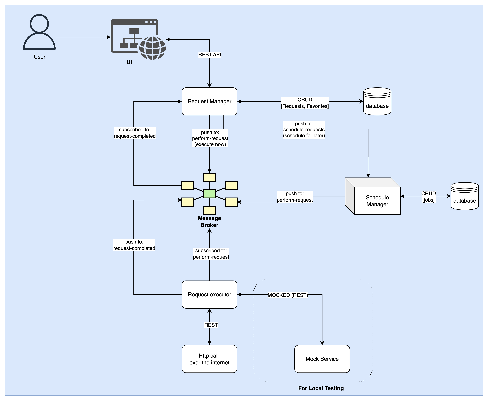

# Service Agent

Service Agent provides a unified multi-tenant agent for executing service calls via a message protocol (RabbitMQ), with a user interface to trigger, schedule, filter, and tag calls, and view their execution status.

## System Architecture



## Multi-Tenancy Logic
- I have implemented multi-tenancy by creating separate exchanges and queues for each tenant in RabbitMQ.
  Each tenant has its own set of queues for performing requests, scheduling requests, and handling completed requests.
  This ensures that the requests and their statuses are isolated per tenant.
- In the database, each request document is associated with a tenant ID to maintain this separation.
- The backend services are designed to handle requests based on the tenant context, ensuring that operations are performed within the scope of the selected tenant.
- The UI allows users to select a tenant and view/manage requests specific to that tenant.
- The Service can deploy more tenants by adding names of tenants in the `TENANTS` env variable as a comma-separated list.
  - Example: `TENANTS=tenant1,tenant2,tenant3`
  - When a new tenant is added, the necessary exchanges and queues are created automatically in RabbitMQ.
  - After updating the TENANTS variable, you will need to restart the services with `make reload` to pick up the new tenant configuration.
  - The UI will also reflect the new tenants in the tenant selection dropdown.

## Flow of control
1. We have the following queues available on RabbitMQ for each tenant:
  - perform-request
    - This queue is used to push a request to be completed as soon as possible
    - It is picked up by the request-executor to perform the actual request
  - schedule-request
    - This queue is used to push a request to be scheduled for later
    - It is picked up by the job scheduler service and once the time is up it sends a message in perform-request queue
  - request-completed
    - This queue is used by the request-executor to send a message once the request is completed
    - It is picked up by the request-manager service to update the status of the request in the database

## Steps to run

1. If you have Make installed, you can use the Makefile included to set up the project

Run:

```bash
make build
```
This will copy the env.example into .env file and then start the services using Docker

2. If you do not want to use the Makefile you can manually run the following commands:
```bash
cp .env.example .env
docker-compose up -d
```

## Usage

1. Once the containers are running you can access the UI at `localhost:8000` (in case you changed the port for `UI_PORT` in `.env` then please use that port instead)
2. You will land on the dashboard where you need to select a `Tenant` to work with
3. Once inside a tenant you can:
   - Create a new `Service Call` by clicking on `New Request` from the top menu and then providing the necessary details like URL, method, headers, body, etc.
   - Trigger the service call immediately or schedule it for later
   - View the status of all service calls in the `Requests List` section
   - Filter requests based on status and favorite
   - View detailed logs for each request to debug any issues
   - Make requests favorite by clicking on the star icon next to the request for easier filtering
   - Your current selected tenant will always show in the top menu

## Sample Requests (Local)
Here are some sample requests you can use to test the service on local system without any internet:

I have set up a WireMock server that runs on port 8080 inside the Docker network. You can use the following endpoints to test the service:
- Health Check
  - Request Type: GET 
  - URL: http://wiremock:8080/health
  - Description: Basic health check endpoint 
- Weather API 
  - Request Type: GET 
  - URL: http://wiremock:8080/api/weather/current
  - Description: Get current weather information 
- Products API 
  - Request Type: GET
  - URL: http://wiremock:8080/api/products/{id}
  - Description: Get product details by ID (replace {id} with any number)
  - Example: http://wiremock:8080/api/products/123
- Orders API
  - Request Type: POST 
  - URL: http://wiremock:8080/api/orders
  - Headers: Content-Type: application/json
  - Body: 
    ```json
    {
      "customerId": 12345,
      "items": [
        {
          "productId": "67890",
          "quantity": 2
        }
      ]
    }
    ```
    
## Sample Requests (External)
Here are some sample requests you can use to test the service with external publicly available APIs:
- JSONPlaceholder (Fake Online REST API for Testing)
  - Get All Posts 
    - Request Type: GET 
    - URL: https://jsonplaceholder.typicode.com/posts
    - Description: Retrieve all blog posts 
  - Get Single Post 
    - Request Type: GET 
    - URL: https://jsonplaceholder.typicode.com/posts/{id}
    - Description: Get a specific post by ID (replace {id} with 1-100)
    - Example: https://jsonplaceholder.typicode.com/posts/1
  - Create New Post 
    - Request Type: POST 
    - URL: https://jsonplaceholder.typicode.com/posts
    - Headers: Content-Type: application/json 
    - Body:
    ```json
      {
      "title": "Sample Post",
      "body": "This is a sample post body",
      "userId": 1
      }
    ```
  - Update Post 
    - Request Type: PUT 
    - URL: https://jsonplaceholder.typicode.com/posts/{id}
    - Headers: Content-Type: application/json 
    - Body:
    ```json
      {
      "id": 1,
      "title": "Updated Post Title",
      "body": "Updated post content",
      "userId": 1
      }
    ```
  - Delete Post 
    - Request Type: DELETE 
    - URL: https://jsonplaceholder.typicode.com/posts/{id}
    - Description: Delete a specific post by ID 
    - Example: https://jsonplaceholder.typicode.com/posts/1
  - Get User Comments 
    - Request Type: GET 
    - URL: https://jsonplaceholder.typicode.com/posts/{id}/comments
    - Description: Get all comments for a specific post 
    - Example: https://jsonplaceholder.typicode.com/posts/1/comments
  - Get All Users 
    - Request Type: GET 
    - URL: https://jsonplaceholder.typicode.com/users
    - Description: Retrieve all users

## Testing
I added some basic unit tests for one of the services (request-executor) to demonstrate how testing can be done.

To run the tests:
- Makefile command:
  ```bash
  make test
  ```
- Manual Command:
  ```bash
  cd request-executor
  npm install
  npm test
  ```

## Technologies Used
- Backend: [Node.js](https://nodejs.org/en/) & [Express](https://expressjs.com/)
- Frontend: [Vue.js](https://vuejs.org/)
- Database: [MongoDB](https://www.mongodb.com/)
- Message Broker: [RabbitMQ](https://www.rabbitmq.com/)
- Containerization: [Docker](https://www.docker.com/)
- Task Scheduling: [agenda](https://github.com/agenda/agenda)
- Mock Server for Local Testing: [WireMock](http://wiremock.org/)